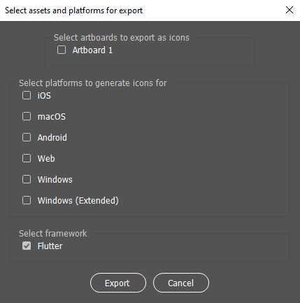

# Flutter Icon Generator

Script for generating icons for Flutter apps from Adobe Illustrator. The script can also be used for other,
more generic projects.

## Setup

Copy the file `ai/FlutterGenerateIcons.jsx` to 

- `~/Applications/{Adobe Illustrator}/Presets/{locale}/Scripts/` for macOS, or
- `C:\Program Files\Adobe\{Adobe Illustrator}\Presets\{locale}\Scripts\` for Windows.

## Usage

### Flutter projects

1. [Setup](#Setup) the scripts for your desired program.
2. Open your icon file.
3. Open menu `File -> Scripts`.
4. Click on `FlutterGenerateIcons`.
5. From popup select the **root** of your Flutter project (directory containing `pubspec.yaml` file).
6. In the main window of script
   - choose the Artboard you want exported,
   - platforms for which you want to generate the icons, and
   - leave Flutter checked under frameworks.
7. Click on "Export" button and wait for the window to close.
8. If everything went as expected, you should have appropriate icons in desired folders.

### Non-Flutter projects

1. [Setup](#Setup) the scripts for your desired program.
2. Open your icon file.
3. Open menu `File -> Scripts`.
4. Click on `FlutterGenerateIcons`.
5. From popup select the folder depending on type of your project.
   - *iOS:* Select the `Assets.xcassets` directory.
   - *macOS:* Select the `Assets.xcassets` directory.
   - *Android:* Select the root of your Android project.
6. In the main window of script
   - choose the Artboard you want exported,
   - platform for which you want to generate the icons, and
   - uncheck the Flutter checkbox under frameworks.
7. Click on "Export" button and wait for the window to close.
8. If everything went as expected, you should have appropriate icons in desired folders.

### Creating an ICO file

By defualt, when creating an icon for Windows, only PNGs of different sizes are created. In order to
combine them into a `.ico` file, use [`png2ico`](https://www.winterdrache.de/freeware/png2ico/). Usage is
completely straightforward and a project has great documentation.

## User interface

The user interface is completely straightforward and plain, without any unnecessary garbage.

## License

This project is licensed under [MIT License](LICENSE).

## Contributing

If you have a suggestion for another framework, or software like Photoshop, feel free to file an issue,
or even a pull request!

**If you find this project useful, consider giving it a star. It would mean a lot to me!**
